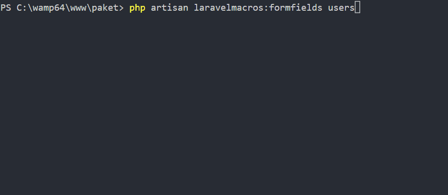

# LaravelMacros

[![Latest Version on Packagist][ico-version]][link-packagist]
[![Total Downloads][ico-downloads]][link-downloads]
[![Build Status][ico-travis]][link-travis]
[![StyleCI][ico-styleci]][link-styleci]

I'm sick of doing same things on every project,so i made package with some handful shourtcuts.
> Not stable for production

## Installation

Via Composer

``` bash
$ composer require erdemozveren/laravelmacros
```

## Getting Started

`LaravelMacros` aims to build simple skeleton for forms and form proccess easy
To getting started add in your model `use erdemozveren\LaravelMacros\Traits\FormBuilderTrait;` then in class use it as trait `use FormBuilderTrait;` now you ready to continue!

this package add Laravel collective macros to get things easier,you can use it by just simply add "c" to start and Upper case next letter,like this;

`Form::text('email', 'example@gmail.com') --> Form::cText('email', 'example@gmail.com')`
## Usage
###Form Builder
add formFields function to model
```php
public function formFields() {
    return [
        "*"=>[ // wildcard will be applied to all elements 
            "options"=>
            ["style"=>"color:red!important"]
        ],
        "parent_id"=>[ // "parent_id" is the name attribute
            "type"=>"select", // input type (e.g. "select" will look for "cSelect")
            "label"=>"Parent", // label text
            "data"=>User::pluck('full_name','id'), // [ONLY FOR select] you can write any data source that laravel collective accepts
            "options"=>[ // optional
                "required"=>false // optional make input optional
                // ... and other "laravel collective" options and dom parameters can be used in here
            ]
        ],
        "full_name"=>[
            "type"=>"text",
            "label"=>"Full Name",
        ],
        "email"=>[
            "type"=>"text",
            "label"=>"E-mail",
        ],
        "password"=>[
            "type"=>"password",
            "label"=>"Password",
        ],
    ];
}
```
### Generate Form 

In your blade file you can use like this
```php
{!!Form::model($model,['url'=>"/post"])!!}
{!!$model->generateForm()!!}
{!!Form::cSubmit()!!}
{!!Form::close()!!}
```
or
```php
{!!Form::open(['url'=>"/post"])!!}
{!!$model->generateForm()!!}
{!!Form::cSubmit()!!}
{!!Form::close()!!}
```
if you want to exclude one or more elements in one form just pass option `_exclude` with array of fields name
```php
{!!$model->generateForm(["_exclude"=>["full_name","another_filed_name"]])!!}
```
### Auto generate form fields
``` bash
$ php artisan laravelmacros:formfields {tablename}
```
it will ask you some questions then give you `formFields` function code to copy into model file


## Change log

Please see the [changelog](changelog.md) for more information on what has changed recently.


## Contributing

Please see [contributing.md](contributing.md) for details and a todolist.

## Security

If you discover any security related issues, please email author email instead of using the issue tracker.

## Credits

- [Erdem Özveren][link-author]
- [All Contributors][link-contributors]

## License

MIT

[ico-version]: https://img.shields.io/packagist/v/erdemozveren/laravelmacros.svg?style=flat-square
[ico-downloads]: https://img.shields.io/packagist/dt/erdemozveren/laravelmacros.svg?style=flat-square
[ico-travis]: https://img.shields.io/travis/erdemozveren/laravelmacros/master.svg?style=flat-square
[ico-styleci]: https://styleci.io/repos/12345678/shield

[link-packagist]: https://packagist.org/packages/erdemozveren/laravelmacros
[link-downloads]: https://packagist.org/packages/erdemozveren/laravelmacros
[link-travis]: https://travis-ci.org/erdemozveren/laravelmacros
[link-styleci]: https://styleci.io/repos/12345678
[link-author]: https://github.com/erdemozveren
[link-contributors]: ../../contributors
